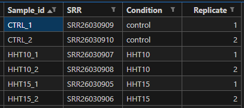

# RNA-seq Analysis Pipeline/PRJNA1014743
## Datasets
- Dataset PRJNA1014743 (Jurkat T-ALL cells ± homoharringtonine, HHT)
- Blood. 2024 /  PMID: 38968151
- Homoharringtonine inhibits the NOTCH/MYC pathway and exhibits antitumor effects in T-cell acute lymphoblastic leukemia

## Folder layout
~~~
project_PRJNA1014743/
├─ meta/             # metadata.csv
├─ raw/              # SRA
├─ raw_fastq         # FASTQs
├─ ref/              # STAR_index_gencodev44
├─ qc/               # multiqc_report.html
├─ r/                # R scripts
└─ results/          # DE tables, plots, GSEA
~~~
## (0) Data Acquisition
**Get SRR runs & metadata (SRA → FASTQ)**

<https://www.ncbi.nlm.nih.gov/sra/?term=PRJNA1014743>

On the PRJNA1014743 page, click “Send to” → “Run Selector” → “Run Selector” → "Download Metadata/Accession List". 
Save as **metadata.csv**
Edit a minimal metadata.csv with columns:

**Conda environment setup (SRA tools + helpers)**
~~~
# bash
# Create a dedicated environment
conda create -n sra -c bioconda -c conda-forge sra-tools pigz
conda activate sra

# Verify installation
which fasterq-dump
fasterq-dump --version  #fasterq-dump : 3.2.1
~~~
Note: fasterq-dump is faster but doesn’t gzip; we’ll compress with pigz.

## (1) Downloading SRA Files
### (1.1) Fetch single case from NCBI SRA
~~~
bash
pwd # project_PRJNA1014743
prefetch --max-size 200G -O raw_test SRR26030905 
prefetch --max-size 200G -O raw_test SRR26030906 
prefetch --max-size 200G -O raw_test SRR26030907
prefetch --max-size 200G -O raw_test SRR26030908 
prefetch --max-size 200G -O raw_test SRR26030909
prefetch --max-size 200G -O raw_test SRR26030910

ls -lh raw_test/SRR26030905/ #check the file size 
~~~

### (1.2) Fetch batch case from NCBI SRA
~~~
cut -d, -f2 meta/metadata.csv | tail -n +2 | tr -d '\r' | while read -r SRR; do
  [ -z "$SRR" ] && continue
  echo "==> prefetch $SRR"
  prefetch --max-size 200G -O raw "$SRR"
done
~~~

This will produce files like:
- raw/SRR26030905/SRR26030905.sra
- raw/SRR26030906/SRR26030906.sra
- raw/SRR26030907/SRR26030907.sra
- raw/SRR26030908/SRR26030908.sra
- raw/SRR26030909/SRR26030909.sra
- raw/SRR26030910/SRR26030910.sra

### (1.3) Convert .sra archive files into plain FASTQ files
**Convert single file**
~~~
#bash
mkdir -p raw_fastq
fasterq-dump raw/SRR26030905/SRR26030905.sra -e 8 -p --split-files -t tmp -O raw_fastq/
~~~

**Convert batch file**
~~~
#bash
pwd #project_PRJNA1014743
for sra in raw/*/*.sra; do
  SRR=$(basename "$sra" .sra)
  echo "==> Converting $SRR"
  fasterq-dump "$sra" -e 8 -p --split-files -t tmp -O raw_fastq/
done
~~~
This will produce files like:
- raw_fastq/SRR26030905_1.fastq
- raw_fastq/SRR26030905_2.fastq
- raw_fastq/SRR26030906_1.fastq
- raw_fastq/SRR26030906_2.fastq
- raw_fastq/SRR26030907_1.fastq
- raw_fastq/SRR26030907_2.fastq
- raw_fastq/SRR26030908_1.fastq
- raw_fastq/SRR26030908_2.fastq
- raw_fastq/SRR26030909_1.fastq
- raw_fastq/SRR26030909_2.fastq
- raw_fastq/SRR26030910_1.fastq
- raw_fastq/SRR26030910_2.fastq

## (2) Raw Data Quality Control
### (2.1) Intsall FastQC
~~~
# bash
conda activate sra

conda install -c bioconda multiqc
multiqc --version  #multiqc, version 1.30     
~~~

### (2.2) Run QC checks
~~~
# bash
mkdir -p qc/fastqc qc/multiqc
# Run FastQC (6 threads)
fastqc -t 6 -o qc/fastqc raw_fastq/*.fastq

# Summarize reports
multiqc -o qc/multiqc qc/fastqc
~~~

This will produce files like:
- qc/fastqc/SRR26030905_1.fastqc.html
- qc/fastqc/SRR26030905_1.fastqc.zip
- qc/fastqc/SRR26030905_2.fastqc.html
- qc/fastqc/SRR26030905_2.fastqc.zip
...

- qc/multiqc/multiqc_report.html
~~~
qc/multiqc/multiqc_report.html

1. ~25M reads per sample
2. ~50% GC content (normal for human)
3. Low adapter contamination
4. <1% overrepresented sequences
5. Quality scores are consistently high
~~~

## (3) Build STAR index
- Construct STAR index
- Map reads (paired-end; GeneCounts)
- Generate a **counts matrix** (auto-detect strandedness)

### (3.1) Construct STAR index
**Job Script: star_genome.sh**
~~~
#!/bin/bash
#BSUB -J star_genome
#BSUB -q standard
#BSUB -n 32
#BSUB -W 24:00
#BSUB -o star_genome.%J.out
#BSUB -e star_genome.%J.err
#BSUB -R "span[hosts=1]"
# ~32 * 5.6GB ≈ 180GB total
#BSUB -R "rusage[mem=5600]"
# Hard cap in MB (>= requested total)
#BSUB -M 180000

set -euo pipefail

# initialize conda in batch shells
eval "$(conda shell.bash hook)"
conda activate sra

cd ***Sep/project_PRJNA1014743/ref
rm -rf STAR_index_gencodev44 _STARtmp
mkdir -p STAR_index_gencodev44

STAR \
  --runThreadN 32 \
  --runMode genomeGenerate \
  --genomeDir STAR_index_gencodev44 \
  --genomeFastaFiles GRCh38.primary_assembly.genome.fa \
  --sjdbGTFfile gencode.v44.annotation.gtf \
  --sjdbOverhang 149 \
  --limitGenomeGenerateRAM 170000000000
~~~

**Job Submit:star_genome.sh**
~~~
# bash
bsub < star_genome.sh
~~~

**Job Monitor**
~~~
bjobs -w -u $USER            # see when it’s RUN and on which node
bpeek -f <JOBID>             # live stdout once RUN (replace with actual ID)
tail -f star_genome.<JOBID>.out
tail -f star_genome.<JOBID>.err
tail -f STAR_index_gencodev44/Log.out
~~~

### (3.2) Map reads (paired-end; GeneCounts)
**Job Script: mapping.sh**
~~~
#!/usr/bin/env bash
#BSUB -J star_map_gencodev44_PE
#BSUB -o logs/star_map_gencodev44_PE.%J.out
#BSUB -e logs/star_map_gencodev44_PE.%J.err
#BSUB -n 16
#BSUB -R "span[hosts=1]"
#BSUB -R "rusage[mem=4000]"     # ~4 GB/core -> ~64 GB total
#BSUB -M 64000                  # hard memory limit (MB)
#BSUB -W 24:00                  # walltime hh:mm
# (no -q line; uses default queue)

set -euo pipefail

# =========================
# Project-specific settings
# =========================
PROJECT="***/Sep/project_PRJNA1014743"
FASTQ_DIR="${PROJECT}/raw_fastq"   # paired-end FASTQs live here
GENOME_DIR="${PROJECT}/ref/STAR_index_gencodev44"
GTF="***/Sep/project_PRJNA1014743/ref/gencode.v44.annotation.gtf"
OUTROOT="${PROJECT}/mapping"       # all results go here
THREADS=${LSB_DJOB_NUMPROC:-16}    # LSF core count (default 16)

# Optional: tidy small intermediates after each sample
CLEAN_INTERMEDIATES=true

# =========================
# Pre-flight checks
# =========================
mkdir -p "${OUTROOT}" logs

if ! command -v STAR >/dev/null 2>&1; then
  echo "ERROR: STAR not found in PATH." >&2
  exit 1
fi

if [[ ! -s "${GENOME_DIR}/Genome" ]]; then
  echo "ERROR: STAR index appears incomplete at ${GENOME_DIR} (missing Genome file)." >&2
  exit 1
fi

if [[ ! -s "${GTF}" ]]; then
  echo "ERROR: GTF not found at ${GTF}" >&2
  exit 1
fi

shopt -s nullglob

# Collect R1 files using common patterns (gz + plain; .fastq + .fq)
R1S=( \
  "${FASTQ_DIR}"/*_R1_001.fastq.gz "${FASTQ_DIR}"/*_R1.fastq.gz "${FASTQ_DIR}"/*_1.fastq.gz \
  "${FASTQ_DIR}"/*_R1_001.fq.gz   "${FASTQ_DIR}"/*_R1.fq.gz   "${FASTQ_DIR}"/*_1.fq.gz \
  "${FASTQ_DIR}"/*_R1_001.fastq   "${FASTQ_DIR}"/*_R1.fastq   "${FASTQ_DIR}"/*_1.fastq \
  "${FASTQ_DIR}"/*_R1_001.fq      "${FASTQ_DIR}"/*_R1.fq      "${FASTQ_DIR}"/*_1.fq \
)

# Filter out non-matches
TMP=()
for f in "${R1S[@]}"; do [[ -e "$f" ]] && TMP+=("$f"); done
R1S=("${TMP[@]}")

if (( ${#R1S[@]} == 0 )); then
  echo "No R1 FASTQ files found in ${FASTQ_DIR}" >&2
  exit 1
fi

echo "Found ${#R1S[@]} R1 FASTQs in ${FASTQ_DIR}"
echo "Output directory: ${OUTROOT}"
echo "Using index: ${GENOME_DIR}"
echo "Using GTF: ${GTF}"
echo "Threads: ${THREADS}"

# Helper: guess R2 from R1 (supports gz/plain, fastq/fq)
guess_r2() {
  local r1="$1" r2=""
  if   [[ "$r1" =~ _R1_001\.fastq\.gz$ ]]; then r2="${r1/_R1_001.fastq.gz/_R2_001.fastq.gz}"
  elif [[ "$r1" =~ _R1\.fastq\.gz$     ]]; then r2="${r1/_R1.fastq.gz/_R2.fastq.gz}"
  elif [[ "$r1" =~ _1\.fastq\.gz$      ]]; then r2="${r1/_1.fastq.gz/_2.fastq.gz}"
  elif [[ "$r1" =~ _R1_001\.fq\.gz$    ]]; then r2="${r1/_R1_001.fq.gz/_R2_001.fq.gz}"
  elif [[ "$r1" =~ _R1\.fq\.gz$        ]]; then r2="${r1/_R1.fq.gz/_R2.fq.gz}"
  elif [[ "$r1" =~ _1\.fq\.gz$         ]]; then r2="${r1/_1.fq.gz/_2.fq.gz}"

  elif [[ "$r1" =~ _R1_001\.fastq$     ]]; then r2="${r1/_R1_001.fastq/_R2_001.fastq}"
  elif [[ "$r1" =~ _R1\.fastq$         ]]; then r2="${r1/_R1.fastq/_R2.fastq}"
  elif [[ "$r1" =~ _1\.fastq$          ]]; then r2="${r1/_1.fastq/_2.fastq}"
  elif [[ "$r1" =~ _R1_001\.fq$        ]]; then r2="${r1/_R1_001.fq/_R2_001.fq}"
  elif [[ "$r1" =~ _R1\.fq$            ]]; then r2="${r1/_R1.fq/_R2.fq}"
  elif [[ "$r1" =~ _1\.fq$             ]]; then r2="${r1/_1.fq/_2.fq}"
  fi
  printf "%s" "$r2"
}

# Helper: decide STAR readFilesCommand based on extensions
read_cmd_args_for_pair() {
  local r1="$1" r2="$2"
  if [[ "$r1" == *.gz && "$r2" == *.gz ]]; then
    # Compressed: use zcat (STAR will read from stdin)
    printf "%s" "--readFilesCommand zcat"
  else
    # Plain text: no flag needed
    printf "%s" ""
  fi
}

# Helper: clean sample name (strip common R1 suffixes incl. gz/plain)
clean_sample_name() {
  local base="$1"
  local s="$base"
  s="${s%_R1_001.fastq.gz}"; s="${s%_R1.fastq.gz}"; s="${s%_1.fastq.gz}"
  s="${s%_R1_001.fq.gz}";    s="${s%_R1.fq.gz}";    s="${s%_1.fq.gz}"
  s="${s%_R1_001.fastq}";    s="${s%_R1.fastq}";    s="${s%_1.fastq}"
  s="${s%_R1_001.fq}";       s="${s%_R1.fq}";       s="${s%_1.fq}"
  printf "%s" "$s"
}

# =========================
# Alignment loop (paired-end)
# =========================
for fq1 in "${R1S[@]}"; do
  fq2=$(guess_r2 "$fq1")
  if [[ -z "${fq2}" || ! -e "${fq2}" ]]; then
    echo "WARNING: Could not find R2 for ${fq1}; skipping." >&2
    continue
  fi

  base=$(basename "${fq1}")
  sample="$(clean_sample_name "${base}")"

  outdir="${OUTROOT}/${sample}"
  mkdir -p "${outdir}"

  echo "[$(date)] Mapping ${sample}"
  echo "R1: ${fq1}"
  echo "R2: ${fq2}"

  READCMD="$(read_cmd_args_for_pair "${fq1}" "${fq2}")"

  # Build STAR command (conditionally add --readFilesCommand)
  STAR \
    --runThreadN "${THREADS}" \
    --genomeDir "${GENOME_DIR}" \
    --readFilesIn "${fq1}" "${fq2}" \
    ${READCMD:+$READCMD} \
    --sjdbGTFfile "${GTF}" \
    --twopassMode Basic \
    --outSAMtype BAM SortedByCoordinate \
    --outFileNamePrefix "${outdir}/${sample}_" \
    --quantMode GeneCounts \
    --outSAMattrRGline ID:"${sample}" SM:"${sample}" PL:ILLUMINA \
    --limitBAMsortRAM 55000000000

  # Index BAM if samtools is available
  if command -v samtools >/dev/null 2>&1; then
    samtools index -@ "${THREADS}" "${outdir}/${sample}_Aligned.sortedByCoord.out.bam"
  fi

  # Optional cleanup: keep BAM + BAI + counts + final log
  if [[ "${CLEAN_INTERMEDIATES}" == "true" ]]; then
    rm -f "${outdir}/${sample}_Aligned.out.bam" 2>/dev/null || true
    rm -f "${outdir}/${sample}_SJ.out.tab" 2>/dev/null || true
    rm -f "${outdir}/${sample}_Log.out" 2>/dev/null || true
    rm -f "${outdir}/${sample}_Log.progress.out" 2>/dev/null || true
    rm -f "${outdir}/${sample}_Chimeric.out.junction" 2>/dev/null || true
  fi
done

# =========================
# Summarize mapping metrics
# =========================
summary="${OUTROOT}/mapping_summary.tsv"
echo -e "sample\tUniquely_mapped%\tReads_in_genes_Unstranded\tReads_in_genes_FirstStrand\tReads_in_genes_SecondStrand" > "${summary}"

for log in "${OUTROOT}"/*/*_Log.final.out; do
  s=$(basename "${log}" _Log.final.out)
  uniq_pct=$(awk -F '|' '/Uniquely mapped reads %/ {gsub(/%/,"",$2); gsub(/^[ \t]+|[ \t]+$/,"",$2); print $2}' "${log}")
  rpg_dir="$(dirname "${log}")"
  rpg="${rpg_dir}/${s}_ReadsPerGene.out.tab"
  if [[ -f "${rpg}" ]]; then
    unstr=$(awk 'BEGIN{sum=0} !/^N_/ {sum+=$2} END{print sum}' "${rpg}")
    firsts=$(awk 'BEGIN{sum=0} !/^N_/ {sum+=$3} END{print sum}' "${rpg}")
    seconds=$(awk 'BEGIN{sum=0} !/^N_/ {sum+=$4} END{print sum}' "${rpg}")
  else
    unstr=NA; firsts=NA; seconds=NA
  fi
  sample="${s%_*}"
  echo -e "${sample}\t${uniq_pct}\t${unstr}\t${firsts}\t${seconds}" >> "${summary}"
done

echo "[$(date)] Done."
echo "Results per sample are in: ${OUTROOT}/<sample>/"
echo "Project summary written to: ${summary}"

~~~

**Job Submit**
~~~
mkdir -p logs mapping
bsub < mapping.sh
~~~

This will produce files like:
logs/star_map_gencodev44_PE.269463854.err
logs/star_map_gencodev44_PE.269463854.out

~~~
mapping/SRR26030905├─ SRR26030905__STARgenome → temporary directories        
                   ├─ SRR26030905__STARpass1 → temporary directories
                   ├─ SRR26030905_Aligned.sortedByCoord.out.bam → the final alignment result
                   ├─ SRR26030905_Log.final.out → the QC report of the alignment
                   ├─ SRR26030905_ReadsPerGene.out.tab → the raw gene-level count results

mapping/SRR26030906
mapping/SRR26030907
mapping/SRR26030908
mapping/SRR26030909
mapping/SRR26030910
~~~

#### (3.3) Generate a counts matrix (auto-detect strandedness)
**Job Script: make_counts.py**
~~~
#!/usr/bin/env python3
import argparse, sys
from pathlib import Path
import pandas as pd
import re

def parse_args():
    p = argparse.ArgumentParser(description="Merge STAR ReadsPerGene.out.tab into a counts matrix.")
    p.add_argument("--mapping-root", required=True,
                   help="Path to the directory containing per-sample folders (e.g., PROJECT/mapping)")
    p.add_argument("--strand", choices=["unstranded","firststrand","secondstrand"],
                   default="secondstrand",
                   help="Which STAR column to use: unstranded (col2), firststrand (col3), secondstrand (col4). Default: secondstrand")
    p.add_argument("--out", default="counts_matrix.tsv",
                   help="Output TSV (genes x samples). Default: counts_matrix.tsv")
    p.add_argument("--summary-out", default="mapping_qc_summary.tsv",
                   help="Optional summary TSV from Log.final.out and totals. Default: mapping_qc_summary.tsv")
    p.add_argument("--gene-column-name", default="gene_id",
                   help="Name of the first column (gene IDs). Default: gene_id")
    return p.parse_args()

def read_star_counts(fp: Path, strand_choice: str) -> pd.Series:
    # STAR columns: 1=gene_id, 2=unstranded, 3=firststrand, 4=secondstrand
    usecol = {"unstranded": 1, "firststrand": 2, "secondstrand": 3}[strand_choice]
    df = pd.read_csv(fp, sep="\t", header=None, comment=None)
    # drop STAR’s N_* rows
    df = df[~df[0].astype(str).str.startswith("N_")]
    # ensure numeric
    df[usecol] = pd.to_numeric(df[usecol], errors="coerce").fillna(0).astype(int)
    s = pd.Series(df[usecol].values, index=df[0].astype(str))
    return s

def sample_name_from_readspergene(path: Path) -> str:
    # <mapping>/<sample>/<sample>_ReadsPerGene.out.tab
    # Use folder name as sample when possible
    return path.parent.name

def parse_log_final_out(fp: Path) -> dict:
    # Pull a few useful metrics; be robust to spacing
    metrics = {"sample": fp.parent.name}
    keymap = {
        "Number of input reads": "input_reads",
        "Uniquely mapped reads %": "uniquely_mapped_percent",
        "Average input read length": "avg_read_len",
        "Mismatch rate per base, %": "mismatch_rate_percent",
        "Percentage of reads mapped to multiple loci": "multi_mapped_percent",
        "Percentage of reads unmapped: too many mismatches": "unmapped_too_many_mm_percent",
        "Percentage of reads unmapped: too short": "unmapped_too_short_percent",
        "Percentage of reads unmapped: other": "unmapped_other_percent",
    }
    try:
        with open(fp) as f:
            for line in f:
                if "|" not in line: 
                    continue
                k, v = line.split("|", 1)
                k = k.strip()
                v = v.strip().rstrip("%")
                if k in keymap:
                    # numeric if possible
                    try:
                        metrics[keymap[k]] = float(v.replace(",", ""))
                    except ValueError:
                        metrics[keymap[k]] = v
    except FileNotFoundError:
        pass
    return metrics

def main():
    args = parse_args()
    root = Path(args.mapping_root)
    if not root.is_dir():
        sys.exit(f"ERROR: mapping root not found: {root}")

    pattern = "**/*_ReadsPerGene.out.tab"
    files = sorted(root.glob(pattern))
    if not files:
        sys.exit(f"ERROR: No ReadsPerGene.out.tab files under {root}")

    all_series = []
    sample_order = []
    qc_rows = []
    for f in files:
        sname = sample_name_from_readspergene(f)
        try:
            s = read_star_counts(f, args.strand)
        except Exception as e:
            print(f"WARNING: failed to read {f}: {e}", file=sys.stderr)
            continue
        s.name = sname
        all_series.append(s)
        sample_order.append(sname)

        # Try to parse Log.final.out & total counts
        logf = f.with_name(f.name.replace("_ReadsPerGene.out.tab","_Log.final.out"))
        qc = parse_log_final_out(logf)
        # total counts from selected strand
        total_counts = int(s.sum())
        qc["total_counts_selected_strand"] = total_counts
        qc_rows.append(qc)

    if not all_series:
        sys.exit("ERROR: no valid counts were read.")

    # Align by gene ID union, fill missing with 0
    mat = pd.concat(all_series, axis=1).fillna(0).astype(int)
    mat = mat.loc[sorted(mat.index)]
    # Order columns by discovered sample order
    mat = mat.loc[:, sample_order]

    # Write matrix
    mat.index.name = args.gene_column_name
    mat.to_csv(args.out, sep="\t")

    # Write QC summary (if any)
    if qc_rows:
        qc_df = pd.DataFrame(qc_rows)
        # Move sample to first column if present
        cols = ["sample"] + [c for c in qc_df.columns if c != "sample"]
        qc_df = qc_df.reindex(columns=cols)
        qc_df.to_csv(args.summary_out, sep="\t", index=False)

    print(f"Wrote counts matrix: {args.out}")
    if qc_rows:
        print(f"Wrote QC summary: {args.summary_out}")
    print(f"Strand column used: {args.strand}")

if __name__ == "__main__":
    main()
~~~

**Submit job**
~~~
#bash 
conda install -n sra pandas -y
python3 -c "import pandas as pd; print(pd.__version__)" #2.3.2

python3 make_counts.py
~~~
This will produce files like:
- Counts: **counts_matrix.tsv**
- QC:counts_matrix.tsv

## (4) Data Processing in R
- 4.1 Import counts into R
- 4.2 QC & Visualization
~~~
library(tximport)
library(DESeq2)
library(readr)

# Metadata
coldata <- read.csv("metadata.csv", row.names=1)

# Files
files <- file.path("quant", rownames(coldata), "quant.sf")
names(files) <- rownames(coldata)

# Transcript → gene mapping
tx2gene <- read.csv("tx2gene_gencode_v44.csv")  # transcript_id,gene_id

# Import
txi <- tximport(files, type="salmon", tx2gene=tx2gene)

dds <- DESeqDataSetFromTximport(txi, colData=coldata, design=~ batch + condition)

# Prefilter
keep <- rowSums(counts(dds) >= 10) >= 2
dds <- dds[keep,]
~~~

~~~
vsd <- vst(dds)

plotPCA(vsd, intgroup=c("condition","batch"))

library(pheatmap)
dists <- dist(t(assay(vsd)))
pheatmap(as.matrix(dists))
~~~

## (5) Downstream Analysis
- 5.1 Differential Expression Analysis
- 5.2 Visualization (Volcano plots & Heatmaps)
- 5.3 Pathway Enrichment (GSEA)

**Differential Expression**
~~~
dds <- DESeq(dds)

res <- results(dds, contrast=c("condition","treated","control"))
res <- lfcShrink(dds, contrast=c("condition","treated","control"), type="apeglm")

summary(res)

res_sig <- subset(as.data.frame(res), padj < 0.05 & abs(log2FoldChange) > 1)
write.csv(res_sig, "DE_genes.csv", row.names=TRUE)
~~~

**Visualization (Volcano & Heatmap)**
~~~
library(ggplot2)

res_df <- as.data.frame(res)
ggplot(res_df, aes(x=log2FoldChange, y=-log10(padj))) +
  geom_point(alpha=0.5) +
  geom_vline(xintercept=c(-1,1), linetype="dashed", color="red") +
  geom_hline(yintercept=-log10(0.05), linetype="dashed", color="blue")

topgenes <- head(order(res$padj), 30)
pheatmap(assay(vsd)[topgenes,], cluster_rows=TRUE, cluster_cols=TRUE,
         annotation_col=coldata)
~~~

**Pathway Enrichment (GSEA)**
~~~
library(fgsea)
library(msigdbr)

msig <- msigdbr(species="Homo sapiens", category="H") |>
        split(~gene_symbol)

ranks <- res_df$log2FoldChange
names(ranks) <- rownames(res_df)

fg <- fgsea(msig, stats=ranks, minSize=15, maxSize=500, nperm=10000)
write.csv(fg[order(fg$padj),], "GSEA_results.csv")
~~~

## (6) Deliverables

- Processed data

- Visualizations

- Enrichment results

